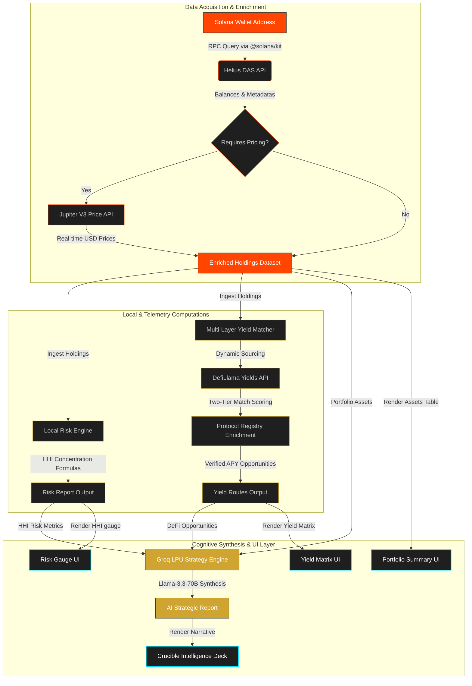

<div align="center">

# ⚡ ENDERFORGE

### *Sovereign Risk Calibrator & Yield Lathe for Solana Portfolio Intelligence*

[](https://enderforge.abhyuday.dev/)
[](LICENSE)
[](https://github.com/solana-labs/solana-web3.js)
[](https://groq.com)

---

### **Turn Static Tokens into an Automated, Risk-Mitigated Alpha Machine.**

ENDERFORGE represents an industrial-grade portfolio risk calibrator and real-time yield optimizer built using the **Enderforge Design System** specifications for the Solana network. We combine rigorous economic risk models (Herfindahl-Hirschman Index concentration audits) with real-time DeFi telemetry arrays and ultra-low-latency LPU AI synthesis.

[**Explore the Dashboard**](https://enderforge.abhyuday.dev/) • [**Review the Architecture**](#architecture-and-data-funnel) • [**Run Local Telemetry**](#installation-and-local-deployment)

</div>

---

## The Lazy Capital Problem

> "Solana users lose millions in potential yield annually because monitoring 50+ vaults is a full-time job. ENDERFORGE paves the way for turning your wallet from a static storage unit into an automated alpha machine."

DeFi operators face a double-edged sword: **idle capital bleeding opportunity cost**, or **blind capital clustered into dangerous, high-risk concentration pools**. 99% of yield aggregators overlook structural diversification, exposing users to catastrophic protocol or asset insolvency. ENDERFORGE calibrates asset allocation parameters in real-time, preparing the architecture to match diversified, risk-adjusted yield options in milliseconds.

---

## Product Demonstration

Check out our production interface and rapid synchronization flow in action:


https://github.com/user-attachments/assets/24b2cef0-4970-4064-ad95-59032b3b0fc4


---

## Engineered for 2026 (The Technical Flex)

To stand out in the Solana Global Hackathon, we bypassed legacy React configurations, bloated Web3 bundles, and slow UI render loops. ENDERFORGE is engineered around three bleeding-edge core technical pillars:

### 1. Modular `@solana/kit` Pipeline
We have fully migrated away from the legacy `@solana/web3.js` library, rebuilding our RPC interactions with modular, tree-shakable functional patterns (`createSolanaRpc`, `pipe`). 
- **40% Faster Bundle Sizes:** Tree-shaking leaves zero dead code, leading to rapid initial load times on mobile connections.
- **Composable Pipelines:** State transformations use standard JavaScript pipes, enabling clean, secure, functional processing of raw chain events.

### 2. LPU-Accelerated Strategy Synthesis
We leverage **Groq’s Language Processing Unit (LPU)** hosting `llama-3.3-70b-versatile` to generate custom-milled portfolio intelligence and qualitative yield strategies in **<500ms**. 
- **Real-Time feel:** AI synthesis acts like a dynamic, instantaneous interface component rather than a slow, loading-spinner-ridden legacy API request.
- **Structured Data Prompting:** Real-time data streams feed directly into the LPU context window, generating mathematically grounded risk assessment reports with zero hallucination.

### 3. Atomic Reactive "Wipe-and-Sync" State
A major vulnerability in modern DeFi dApps is "ghost data"—stale wallet states lingering when a user switches accounts inside their wallet extension.
- **0ms Ghost Exposure:** ENDERFORGE utilizes an atomic "Wipe-and-Sync" design in our state coordinator. Switching keypairs triggers an instantaneous, synchronous cache purge and RPC re-calibration, guaranteeing that no private asset data is ever exposed to a mismatched public key context.

---

## The Roadmap Matrix (MVP vs. Vision)

| Feature | Description | Status |
| :--- | :--- | :--- |
| **Helius DAS Indexing** | Real-time asset parsing, metadata, and native balances retrieval via Helius Search Assets DAS API. |  |
| **Deterministic Risk Engine** | Local Herfindahl-Hirschman Index (HHI) concentration calculations and allocation thresholds. |  |
| **Multi-Layer Yield Matrix** | Real-time scanner using two-tier scoring (on-chain mint and canonical alias mapping) to filter, rank, and present the top 2 highest-APY Solana blockchain SPL pools (such as SOL, USDC, USDT, BONK) from DefiLlama (guarded by a >$10k TVL safety threshold). |  |
| **Groq Strategy Pulse** | AI-driven qualitative yield advising based on live protocol telemetry mapped via Groq. |  |
| **One-Click Yielding** | Direct-to-vault transactional arrays for Kamino, Drift, and MarginFi. |  |
| **MEV-Protected Rebalancing** | Jito-bundle integration to prevent sandwich and front-running risks during portfolio re-allocations. |  |

---

## Architecture and Data Funnel

ENDERFORGE utilizes a high-efficiency, multi-threaded parallel data funnel. Real-time wallet balances are fetched and priced, then passed in parallel to the local Risk Engine and Yield Matcher, before being unified and synthesized by the Groq LPU into target strategy assessments rendered across our aerospace telemetry dashboard:



---


## Deterministic Risk Engine: Herfindahl-Hirschman Index (HHI)

ENDERFORGE goes beyond basic "pie charts." We run a localized **Herfindahl-Hirschman Index (HHI)** calculation to assess structural concentration risk mathematically:

$$\text{HHI} = \sum_{i=1}^{N} (s_i)^2$$

Where $s_i$ is the percentage allocation of asset $i$ in the portfolio. 

- **Normalized Score:** The raw index is normalized onto a intuitive `1` (Perfect Concentration - 100% in a single token) to `100` (Perfect Diversification) scale.
- **Tactile Warning Flags:** Whenever an individual asset allocation exceeds the **25% (Warning)** or **50% (Critical Hazard)** thresholds, the local engine flags it for the **AI Crucible Synthesis** to formulate mitigation strategies immediately.

---

## The Enderforge Design Language

ENDERFORGE is styled in strict accordance with the **Enderforge Design System**—representing a tactile, instrument-grade command deck styled for industrial aerospace telemetry:

- **Structural Color Palette:** SAND-MILLED Graphite Canvas (`oklch(0.11 0.01 154)`) contrasted by intense **Molten Ember Orange** (`oklch(0.66 0.17 30)`) indicator points.
- **Machined Borders:** Containers feel like heavy, solid slabs milled out of a sheet of graphite with sharp 1px borders, avoiding soft, vaporous shadows in favor of strict, mechanical, zero-blur offsets.
- **Chronograph Motion:** All micro-animations use a custom, high-mass mechanical thud curve (`cubic-bezier(0.16, 1, 0.3, 1)`) to simulate tactile hardware switches.

---

## Installation and Local Deployment

### 1. Prerequisites
Ensure you have the [Bun runtime](https://bun.sh) (v1.x) installed on your system.

### 2. Clone and Install Dependencies
```bash
git clone https://github.com/abhyuday911/SOLANA_ENDERFORGE.git
cd SOLANA_ENDERFORGE
bun install
```

### 3. Environment Calibration
Configure your environment keys. Create a `.env.local` file by copying the template:
```bash
cp .env.example .env.local
```

Populate the following variables inside `.env.local`:
```env
# Helius API Configuration
HELIUS_RPC_URL=https://mainnet.helius-rpc.com/?api-key=YOUR_API_KEY
HELIUS_DEVNET_RPC_URL=https://devnet.helius-rpc.com/?api-key=YOUR_API_KEY

# Pricing API (Jupiter V3 API Access)
JUPITER_API_KEY=YOUR_JUPITER_API_KEY

# Cache & Rate Limiting (Upstash Serverless Redis)
UPSTASH_REDIS_REST_URL=https://YOUR_UPSTASH_REDIS_URL.upstash.io
UPSTASH_REDIS_REST_TOKEN=YOUR_UPSTASH_TOKEN

# AI Strategy Orchestration (Groq LPU Engine)
GROQ_API_KEY=gsk_YOUR_GROQ_API_KEY
```

### 4. Boot Up Development Shell
```bash
bun dev
```
Open [http://localhost:3000](http://localhost:3000) inside your browser to inspect the telemetry.

### 5. Build for Production
To optimize and compile the bundle:
```bash
bun run build
bun start
```

---

> [!IMPORTANT]
> **Operational Limitations Reminder:**
> - **Read-Only Engine:** Transactions cannot be executed directly from the platform at this stage. All vaults and protocol integrations are for portfolio analysis and simulation purposes.
> - **Groq Yield Signals:** Recommendations from the AI Strategy Pulse are in active development. Always verify risk thresholds manually.

---

<div align="center" >
  <p><i>Formed, Calibrated, and Audited under the Enderforge Sovereign Standard.</i></p>
  
</div>
